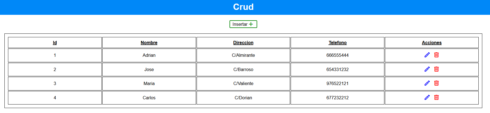

# CrudPHPApi

This is a php project based on displaying users, through the javascript fetch api.

## Table of contents

- [Description](#description)
- [Technologies](#technologies)
- [Installation](#installation)

## Description

This is a php project based on displaying users, through the javascript fetch api. Fetch requests will be made using the GET, POST, PUT, DELETE methods.

The fetch requests will be redirected to a local api, which will obtain this data and send a response to the client.

## Technologies

The project has been created with:

- HTML
- CSS
- PHP 7.4
- JS - FETCH API

## Installation

To run this project, we need the following steps:

- Download XAMPP at the following link: https://www.apachefriends.org/

- Open XAMPP control panel and turn on apache and mysql services.

- Go to your browser to the path of localhost/phpmyadmin and you will see the phpmyadmin database manager running.

- Once inside the phpmyadmin database manager, you have to click the import option. You must select the sql file, which is located in the bbdd folder of this project, which is the following: https://github.com/adri27info/CrudPHPApi/blob/master/bbdd/crud_usuarios.sql

- Once the database is imported through the sql file, we go to the htdocs folder and create the apps/php/ folder and put the CrudPHPApi project inside the php folder, so that everything works. Once this is done, we put http://localhost/apps/php/CrudPHPApi in the browser and we will see that the application will execute correctly.
